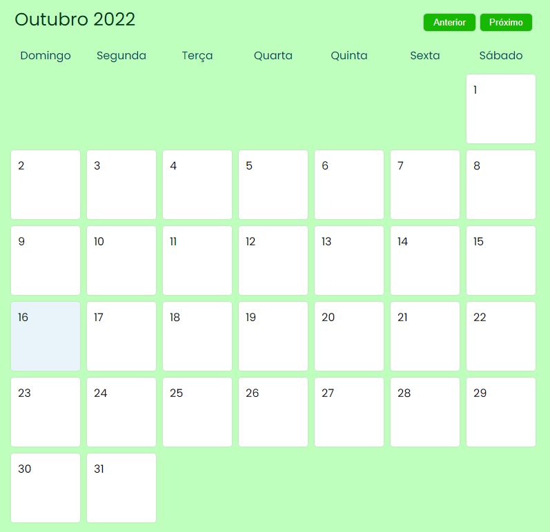

Projeto que simula a Copa do Mundo.

> Escopo:

- Navegação entre os meses do ano;

- Adicionar uma tarefa diária ao calendário, com título, descrição e duração;
- Opção de deletar a atividade ao selecioná-la;
- JavaScipt puro.

> Página do calendário

  

